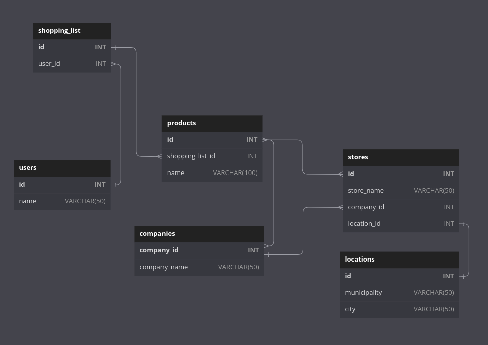

# Supermarkt
<h3>Problem:</h3>

<h3>App description:</h3>

  The application was designed to show the prices of a desired product, giving the opportunity to order them by price
  and/or location and to add them to a shopping list. The purpose of the shopping list is to provide a better user
  experience by sorting the desired products by store. So, the user can save time and money knowing where to buy the
  articles which will be listed by store.

<h3>How it works:</h3>

  User opens the app. User makes a search for a product. The app throws a result with available products by price,
  store and location. User can add products to the shopping cart and will be grouped by store.

<h2>Database Design</h2>

<h3>Entities</h3>
<ul>
  <li>users</li>
  <li>cart</li>
  <li>products</li>
  <li>companies</li>
  <li>stores</li>
  <li>locations</li>
  <li>inventory</li>
</ul>
<h3>
  Relationships
</h3>
<ul>
  <li>One user can only have one cart (one to one).</li>
  <li>A cart can have many products (one to many).</li>
  <li>Products can be sold in many stores and stores can sell many products (many to many).</li>
  <li>Companies can have many stores but a store can only belong to one company (one to many).</li>
  <li>A store can have only one location and a location can have only one store (one to one).</li>
  <li>An inventory represents the availability (true or false) of the products in a store.
    It will be used as a filter method to show the stores where the product is available once the user searches for it.
  </li>
</ul>

