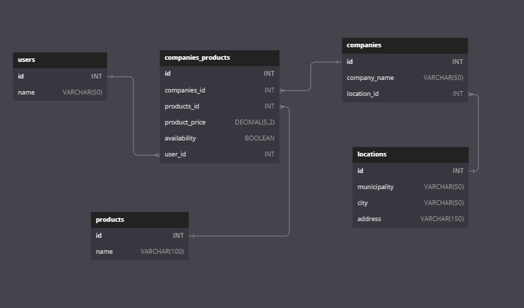

# Supermarkt
<h3>Problem</h3>

Due to the current economic crisis, the living cost has increased significantly. Some part of the population is affected by this and there is a rising need of getting the lowest price of the groceries in order to afford the living expenses.

At the moment, the user would have to go to every shop to get the price of the products of the shopping list. Once the user has all of the prices of all of the stores,  he/she has to filter by price and organise the list by shops. It is then when the user is ready to go back to the stores to buy the chosen items with lowest price.

So logistically speaking, this way to proceed is not feasible as it would imply huge losses of time and money in petrol or travel tickets. 

<h3>Solution</h3>

The approach to solve this issue is to provide a way for the user to check the price of a particular item in comparison with the nearby stores without having to leave their houses. 

<h3>App description:</h3>

  The application was designed to show the prices of a desired product, giving the opportunity to order them by price
  and/or location and to add them to a shopping list. The purpose of the shopping list is to provide a better user
  experience by sorting the desired products by store. So, the user can save time and money knowing where to buy the
  articles which will be listed by store.

<h3>How it works:</h3>

  User opens the app. User makes a search for a product. The app throws a result with available products by price,
  store and location. User can add products to the shopping cart and will be grouped by store.

<h2>Database Design</h2>

<h3>Entities</h3>
<ul>
  <li>users</li>
  <li>users_products</li>
  <li>products</li>
  <li>companies_products</li>
  <li>companies</li>
  <li>locations</li>
</ul>
<h3>
  Relationships
</h3>
<ul>
  <li>One user can only have one shopping list (one to one).</li>
  <li>A shopping list can have many products (one to many).</li>
  <li>Products can be sold in many stores and stores can sell many products (many to many).</li>
  <li>A company will have only one location. (one to one).</li>
  <li>Product availability (true or false) will be used as a filter method to show the stores where the product is available once the user searches for it.
  </li>
</ul>

